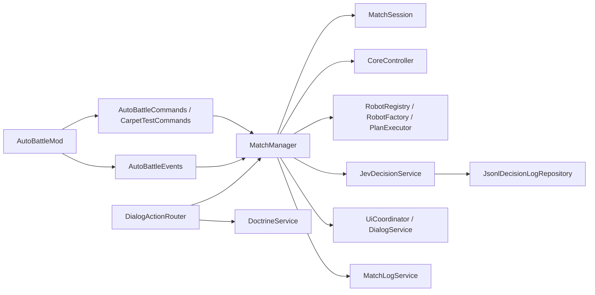

# AutoBattle architecture

This is a code navigation guide for the Minecraft 1.21.8 Fabric dedicated-server mod. It describes the current source layout; `README.md` covers the player-facing contract. Start at `AutoBattleMod` and follow the owner named below before changing a flow.

## Runtime composition

`fabric.mod.json` registers `dev.kardane.autobattle.AutoBattleMod` as the server entry point. `onInitializeServer()` loads configuration and language files, constructs services, and registers `AutoBattleCommands`, optional Carpet test commands, and `AutoBattleEvents`. Services are wired directly in this composition root.



`AutoBattleEvents` calls `MatchManager.tick`, then `PlanExecutor.tick`, then `MatchManager.resolveRobotCombat` at the end of each server tick. It also forwards damage/death, disconnect, and server-stop events. Command registration is in `command/AutoBattleCommands.java`; `command/CarpetTestCommands.java` provides an optional runtime test harness without a compile-time Carpet dependency.

## State and round flow

`MatchManager` is the transition and orchestration owner. `MatchSession` contains the match ID, players, phase, round state, team scores, robot registry, and CORE controller. `PlayerSlot` owns participant identity, Doctrine, runtime state, and personal score; `RoundState` owns round timing. `MatchPhase` defines:

```text
LOBBY → DOCTRINE_SETUP → COUNTDOWN → ROUND_ACTIVE → ROUND_REVIEW
                                                     ↓          ↘
                                               DOCTRINE_EDIT   FINISHED
                                                     ↓          ↓
                                                 COUNTDOWN   fresh LOBBY
```

The operator starts setup after balanced teams join. Players submit three Doctrine rules. During `ROUND_ACTIVE`, `MatchManager.tick` advances player commands, respawns, regeneration, CORE capture/particles, Jev requests, UI, and round timeout. Review readiness advances to Doctrine edit for another round or to final results. On finish, `MatchManager` writes the result, calls `UiCoordinator.onFinished`, then replaces the session with a fresh lobby. Look at the actual transition methods in `MatchManager` for abort and forfeit branches.

`core/CoreController.java` owns capture occupancy, team ownership, telemetry, and particle boundary. The configured `arena.core.radius` is the half-width/depth of the X/Z square; `isInsideBounds` also checks Y distance. The visual perimeter is built from the same X/Z bounds. `combat/` tracks damage and kill resolution; `robot/` creates and tracks robot entities and respawns; `match/ScoreState` and `TeamScoreState` hold personal and team scoring.

`match/TeamScoreboard` registers players and spawned robots on the same colored vanilla scoreboard teams. `MatchManager` restores prior player teams and removes AutoBattle teams on exit. `PlayerCommandService` temporarily swaps player inventory for three command items during active rounds; `AutoBattleEvents` routes right-clicks through the same `use` method as the command tree, so the once-per-round gate is shared. MatchManager switches viewers to Adventure with flight for item input and restores their view mode after the round. Review and Doctrine edit dialogs block Esc until an action is chosen. Final standings use the name captured in `PlayerSlot` on join.

## AI and Doctrine boundaries

`doctrine/DoctrineService` validates and manages initial submission and one-line edits. `OpenAiDoctrineNormalizer` optionally converts player-authored text to canonical rules; the original remains available for display. Missing configuration or normalization failure uses source text. Asynchronous completion returns to the Minecraft server thread through `server.execute(...)` before changing match state. `ui/DialogActionRouter` handles native Dialog payloads delivered through `mixin/ServerCommonPacketListenerImplMixin`; free-form text is carried as data.

`jev/JevDecisionService` snapshots robot and team state, obtains legal candidates from `tactics/ValidPlanFactory`, and calls a `JevClient`. `AutoBattleMod` selects `TypeSafeJevClient` when an API key is present, otherwise `ScriptedJevClient`. The client response is asynchronous; application runs through `server.execute(...)`. The service rejects stale or inapplicable responses, recomputes legal plans, composes a plan with `DecisionComposer`, and applies it via `tactics/PlanExecutor`. It has deterministic fallback behavior for error or unusable answers. `tactics/RobotController` tracks per-robot plan and decision timing; `PlanExecutor` performs Minecraft-side movement and actions. External text is input to a bounded choice system, not executable game logic.

## Config, UI, and persisted output

- `config/AutoBattleConfigLoader.java` embeds the `config/autobattle/config.yml` default and parses it; `ConfigMigrationService` handles older schemas. `LanguageConfigLoader.java` embeds the `config/autobattle/messages.yml` default and `LanguageConfigMigrationService` handles its migration. `ConfigReloadService` loads both and updates the services for `/autobattle admin reload`.
- `ui/UiCoordinator.java` coordinates Sidebar, BossBar, ActionBar, chat, sounds, and native Dialogs. `DialogService` builds the dialogs; `DialogActionRouter` accepts their actions. `review/RoundReviewService` prepares review summaries from decision logs.
- `log/MatchLogService` writes `logs/autobattle/matches/<match-id>.jsonl`. `jev/JsonlDecisionLogRepository` writes `logs/autobattle/decisions/<match-id>.jsonl`. The shared match ID joins both streams. Treat these as runtime records, not repository source.
- The server config can contain API keys. Never copy actual keys into docs, tests, commits, or tool output.

## Change map and proof

| Change | Read first | Useful tests |
| --- | --- | --- |
| Match phases, roster, scores | `match/MatchManager`, `MatchSession`, `PlayerSlot`, `ScoreState` | `src/test/java/dev/kardane/autobattle/match/` |
| Capture geometry or scoring | `core/CoreController`, `CoreState`, `TeamScoreState` | `src/test/java/dev/kardane/autobattle/core/` |
| Jev decisions and tactics | `jev/JevDecisionService`, `DecisionComposer`, `tactics/ValidPlanFactory`, `PlanExecutor` | `src/test/java/dev/kardane/autobattle/jev/` |
| Doctrine or Dialogs | `doctrine/DoctrineService`, `ui/DialogActionRouter`, `DialogService`, `mixin/` | `src/test/java/dev/kardane/autobattle/doctrine/` plus in-game UI check |
| YAML and messages | `config/*Loader`, `ConfigReloadService`, `LanguageService` | `src/test/java/dev/kardane/autobattle/config/` |

Run `.\gradlew.bat test` for unit behavior and `.\gradlew.bat build` for packaging. A server smoke test and a vanilla-client Dialog check are separate runtime evidence. External API success needs a configured test environment and cannot be inferred from scripted-client tests.

## Documentation discrepancy to resolve when touching permissions

At the time of writing, `AutoBattleCommands` gates `/autobattle doctrine view <player>` with `hasPermission(1)`, while `README.md` says permission level 2. Treat the command registration as current behavior; decide the intended contract before changing either. The `/autobattle admin` subtree is gated with `hasPermission(2)`.
